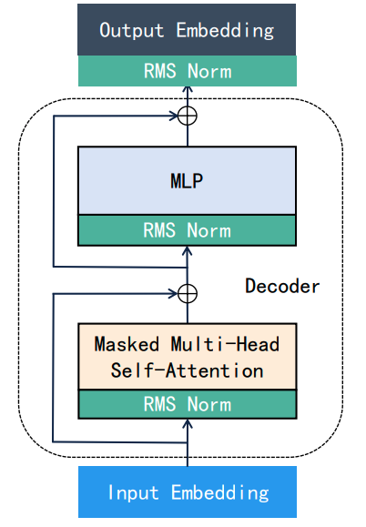
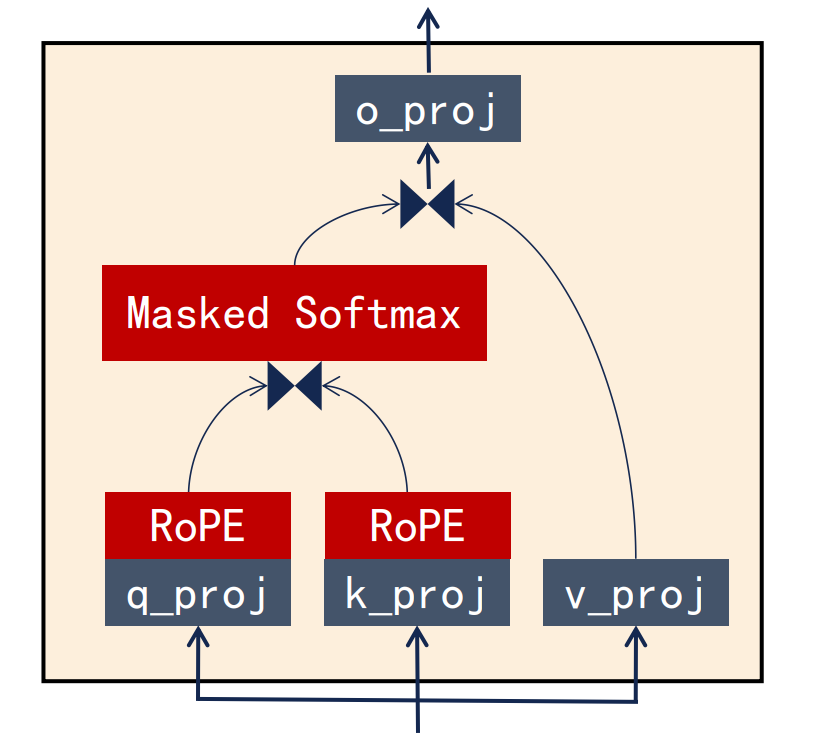

# LLama模型Story的推理实现

Story模型来自于[huggingface仓库](https://huggingface.co/raincandy-u/TinyStories-656K)。通过其huggingface主页的说明，我们可以得到这个模型的以下特征：
- Llama Architecture
- GQA
- hidden_size = 128
- Use tie_word_embeddings
- vocab_size=2048 (Trained on TinystoriesV2 from scratch, using BPE)
- 2 Transformers Layers

这些特点大部分比较直观，但是需要特别注意的是以下两点：
- 这个模型的输入嵌入层和输出层共享权重，也就是使用tie_word_embeddings。
- 这个模型采用了Grouped Query Attention的结构，意味着多个 query head共享一个 key head和 value head。需要在实现的时候特别注意维度不同时的处理。

## 特别说明

为了尽可能减少大家理解文档的成本，这里简单介绍一下本文中的一些重要的的设定。

- **投影**
  - 投影简单来说就是矩阵相乘。本文中的投影往往是指：用模型的参数对中间状态的向量或者中间状态矩阵做一次线性变换，从计算的角度来讲就是做了一次矩阵乘法。
- **矩阵乘法**
  - 本文提到的矩阵乘法和标准的矩阵乘法有所不同，采用的是$AB^T$的形式，其中A的第最后一维与B的最后一维相同。之所以采用这样的形式，是因为在代码中矩阵元素都是按照行优先排列，这样的矩阵组织方式，在计算矩阵乘法时充分利用CPU的高速缓存，提高计算速度。

## 模型加载

这个模型以huggingface提出的`safetensor`格式存储模型。`safetensor`格式的文件主要包含两部分内容：元数据（metadata）部分和数据（data）部分。其中元数据部分存放着矩阵名（name），矩阵数据的偏移量（offset）和形状（shape）。通过矩阵名字，我们可以从`safetensor`的数据区索引到模型各个参数矩阵的内容。加载模型的过程，就是把矩阵数据加载到内存中的过程。

已有的代码并没有完成加载参数的部分，需要自己实现，这部分可以参考rust的`safetensors`的API进行实现。需要特别注意的是，`safetensor`是以字节数据（&[u8]）的格式存储float32类型的数据，需要将这个数组的字节4个4个的聚合在一起，然后用`f32::from_ne_bytes()`以float32的格式读取为float32类型的数据。在这里不需要指定大端字节序或者小端字节序，只需要使用本机字节序（也就是`from_ne_bytes`）来读取数据,即可获得正确的数据。

## 推理过程的具体实现

推理过程简单来说，就是按照模型的结构，使用模型提供的参数，进行相应的运算。在加载模型过程中，推理引擎已经获取了模型的参数，接下来就需要明确模型的结构，按照固定的流程执行推理。第二节课程介绍了LlaMa模型的基本结构，如下图所示：

  

Stroy模型主要包含三个部分：

- Input Embedding：输入嵌入层主要负责将tokenizer生成的每一个`token id`转化为长度为`hidden_size`长度的向量。
- Layers：Story包含相同的两层结构。每一层包含 Masked Multi-head Self-Attention 结构和MLP结构。这两种结构是Story模型中的关键。尤其是 Masked Multi-head Self-Attention 结构，是整个网络中最复杂的部分。
- Output Embedding：输出嵌入层主要是将每一个长度为hidden_size转为一个长度为词典长度（在这里是2048）的向量，通过Softmax将这个向量转化为一个概率分布，进而选择出接下来合适的词。

已有的代码已经实现了Input Embedding，Output Embedding，以及对模型输出后续采样的函数。我们需要实现的是：Masked Multi-head Self-Attention 和 MLP 结构。

### Masked Multi-head Self-Attention 的结构

首先我们需要实现 Masked Multi-head Self-Attention 结构。在论文 [Attention is all you need](https://arxiv.org/abs/1706.03762)论文中介绍了 Masked Multi-head Self-Attention 结构，它是一Transformer架构中的decoder部分，在课程中，也对这个结构进行了详细的介绍。其基本流程如下：

  

### Query投影和Key投影

上面的流程的第一步就是对 Input Embedding 产生的 hidden state进行Query投影和Key投影。需要注意的是：这两种投影针对的对象并不同。其中Query投影的对象是当前输入的 token id，而Key投影的对象是历史所有输入的token id（理想情况下，实际上只会保存有限的历史token）。实操中，为了避免重复计算往往会保存往期 token 的 Key 投影产生的计算结果（代码中的cache），当需要的时候直接取出。

在上面的流程中可以看到，Query投影和Key投影都包含了一次RoPE操作，这个操作的具体原理和实现可以参考论文[RoFormer: Enhanced Transformer with Rotary Position Embedding](https://arxiv.org/pdf/2104.09864)，在这里不多赘述（主要是不懂）。下面这张图展示了这两种投影的具体流程：

  

首先需要将 hidden state 与模型中的 Query 矩阵，Key 矩阵相乘。得到 Q 和 K 向量（对于每一个token来说），接着对 Q 和 K 向量执行RoPE操作，得到最终的投影结果：rope(Q) 和 包含了历史全部Key投影结果的 rope(Full K)。

rope(Q)包含两个维度，第一个维度是当前输入的 token 数量。第二个维度是由每个 Query header 生成结果拼接得到的总和（总共8个）。Rope(Full K)也包含两个维度，第一个维度是包含当前输入和历史输入token的总数，而第二个维度是由每个 Key header 生成结果拼接得到的总和（总共4个）。

### Masked Softmax 实现

在执行Masked SoftMax之前，我们需要现将之间得到的rope(Q)向量和rope(K)向量相乘，得到一个形状为(seq_len, total_seq_len)的矩阵。然而实际上，rope(Q)向量和rope(K)因为维度没有对其并不能直接相乘。那么我们应该如何实现呢？

Story模型介绍中指出了模型采用了 Grouped Query Attention 的设计，在论文[GQA: Training Generalized Multi-Query Transformer Models from Multi-Head Checkpoints](https://arxiv.org/pdf/2305.13245)中，提出了这样的结构，并介绍了单个 Key header 应该如何与整数倍的 Query header 进行计算。下面这张图展示了 Grouped Query Attention 的计算方式，为了方便作图，我们在图中将rope(K)中的K1,K2,K3,K4矩阵的按照竖向排列，但事实上K1,K2,K3,K4是横向排列的：

  

相邻的两个 Q header 与对应位置的 K header 进行矩阵运算，得到两个结果，分别生成两个矩阵。因此最终的结果有四个维度：
- 第一个维度是 K header 的数量。
- 第二个维度是 group 的数量。也就是 Q header 相比于 K header 的倍数。
- 第三个维度是当前输入的token数量。
- 第四个维度是历史所有token数量。

我们将生成的矩阵称为 Attention Score 矩阵，接下来就是对 Attention Score 进行 Masked Softmax 操作了。 Masked Softmax 操作的本质是获取当前输入的token与历史中每一个token之间的关联度。因此主要是针对 Attention Score 矩阵最后两个维度进行计算。

  

Masked Softmax 的精髓在于只计算当前token与其之前token之间的关联度。所谓关联度就是一个概率，一个token与之前token的所有关联度之和就是1。通过 SoftMax 处理 Attention Score 中杂乱无章的元素，被转化token与token之间的相关度。为下面的 Value 投影提供了输入，我们暂且将经过 Masked SoftMax 处理过的矩阵称为 Attention Matrix 。

### Value 投影

Value 投影是一个针对 Attention Matrix 的线性投影，在解释Value投影之前，我们先明确一下 Value 向量是如何产生的：

  

V向量的生成方式与Q向量和K向量略有不同，它不需要进行RoPE操作，hidden state 直接与模型中的Value矩阵相乘即可得到当前token的V向量，与历史token的V向量拼接在一起就得到了Value投影的V向量组，其形状为（total_seq_len, n_kv_head * head_size）。

之前的矩阵投影都发生在二维矩阵之间，而 Attention Matrix 对 Value 向量的投影则是一个四维矩阵与二维矩阵之间的乘法，因此我们必须明确这个乘法是如何进行的，以及结果应该如何呈现。

根据之前的分析，Attention Matrix 最后一维是 total_seq_len，而 Full V 矩阵的第一维也是total_seq_len，如果我们将 Attention Matrix 看成是 n_kv_head * n_group 个 (seq_len, total_seq_len) 矩阵，分别与 Full V 中每一个header对应的矩阵相乘，就可以得到 n_kv_head * n_group 个 (seq_len, n_kv_head * head_size)。如下图所示：

  

根据[Attention is all you need](https://arxiv.org/abs/1706.03762)论文中的说明：在多头注意力机制中，我们将经过V向量投影之后的结果按照顺序排列起来，得到V向量投影的结果。最终得到的结果是一个二维矩阵，形状是（seq_len, head_size * n_group * n_kv_head）。

### O weight 投影
 
Masked Multi-head Self-Attention 最后阶段是使用模型中的 O weight 矩阵将 Value 投影的结果投影成一个形状为(seq_len, hidden_size)的向量组，进行后续的MLP计算。

O weight 矩阵的形状是(hidden_size, n_heads * head_size)，是由n_heads个形状为 (hidden_size, head_size) 的矩阵横向排列而成。因此这里的n_heads 与 Query heads 数量相同，都等于 n_group * n_kv_head。而经过Value投影后得到的结果形状为 (seq_len, head_size * n_group * n_kv_head)， 与 O weight 矩阵可以直接做矩阵乘法，获得形状为为(seq_len，hidden_size)的结果。经过 Masked Multi-head Self-Attention 一系列的变化，得到了与输入形状完全完全一致的结果。最后我们将得到的结果与最初的 hidden state 逐元素相加，得到 Masked Multi-head Self-Attention 最终输出结果，这个结果将会作为MLP结构的输入，进行接下来的计算。

  

### MLP 结构

MLP结构的实现非常的简单，所有的操作都是模型参数矩阵对向量的线性投影。而且因为维度都是对齐的，可以直接调用`MatMul`算子直接运算。

  

上图展示了MLP结构的内部操作，上一层输出的 hidden state 作为MLP的输入，经过RMS标准化之后，分别与参数矩阵 Gate weight 和 Up weight 做矩阵乘法，生成中间结果 Gate 和 Up 矩阵。Gate 和 Up 矩阵作为激活函数`Silu` 的输入，得出的计算结果与模型参数矩阵 Down weight 相乘，与最初的 hidde_state 相加之后得到MLP最后的结果。

## LlaMa模型总结

简而言之，LlaMa模型的一个layer就是由一个 Masked Multi-head Self-Attention 和一个 MLP 结构组成的transformer decoder，经过两阶段的处理，hidden_state 的形状保持不变，这也是LlaMa模型可以不断增加层数的基础。

在Story模型中，我们输入的词经过tokenizer转化为token ids，通过Input Embedding转化为形状为(seq_len, hidden_size)的hidden_state。经过两层decoder结构的处理之后，模型将最终得到的hidden state 通过 Output Embedding 投影和 SoftMax 操作将其转化为字典中词汇的概率分布，通过结合TopK和TopP两种采样策略，选举出最终输出的单词。然后将最新输出的单词作为下一次推理的输入，直至生成目标数量的token。

  

## 如何调试模型

模型调试一旦掌握技巧，其实非常简单，我们可以通过Huggingface提供的Transformer库来加载模型，通过在模型的每一阶段增加hook函数，打印每一步操作的输入和输出。尽管有一部分步骤没法打印出来，但是已经足够用来调试。

但是需要注意以下几点：
- 一定要用`AutoModelForCausalLM`而不是默认的`AutoModel`。AutoModel加载模型，会发现模型参数错误。
- 肉眼对比rust输出的结果和pytorch打印的矩阵结果效率非常低。不过幸运的是，两者打印的结果都十分规整，可以复制结果，将其包装为`pytorch.tensor`，直接计算两者差值。如果全部元素都有较大的差距，可能需要思考存在严重的错误。但是如果是一部分相同，一部分差距较大，则应该思考是否存在计算结果拼接方式有问题。